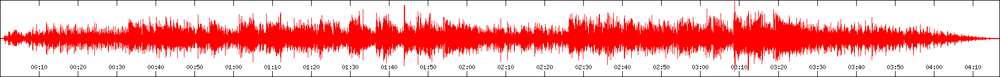

# waveform.js
Waveform generation from audio file using BBC [audiowaveform](https://github.com/bbc/audiowaveform) C++ program.

# How to install
```
git clone https://github.com/loretoparisi/waveform.js
cd waveform.js/
npm install
```

# How to generate a waveform
To generate a waveform from an `wav` audio file you can use the `waveform` api or the `png` api. You need to specify the input `wav` audio file, and the output file, that will be a `json` file or a `png` image. Both the api are `Promise`.

```javascript
var wv = new Waveform({});
wv.waveform({}, 'sample.wav', 'sample.json')
```

## How to generate a png image of the waveform
For a given `wav` file it is possibile to generate the waveform png image.
Please use the `png` api and specify the following parameters:


```javascript
{
    pixelsPerSecond: 7,
    bits: 8,
    width: 1800,
    height: 140,
    backgroundColor: 'FFFFFF00',
    waveformColor: 'FF0000',
    axisLabels: 1
}
```

You will get a nice waveform then
<p align="center"></p>

Please look at `examples/png.js` for an example.

## How to generate a json representation of the waveform
For a given `wav` file it is possibile to generate the waveform as a json file. You use the `waveform` api with the following parameters:

```javascript
{
    bits: 8
}
```

and you will obtain a `json` file with the format:

```json
{
    "version": 2,
    "channels": 1,
    "sample_rate": 8000,
    "samples_per_pixel": 80,
    "bits": 8,
    "length": 26776,
    "data": []
}

where `data` will contain the waveform samples.
Please look at `examples/json.js` for an example.

# API Parameters
# Waveform api
The `waveform` api is defined as
`Waveform.prototype.waveform = function (params, inputPath, outputPath)`
and it supports the following parameters:
```
* bits - Number of bits resolution when creating a waveform data file (either 8 or 16), default: 16
* -s <seconds>	--start <seconds>	Start time (seconds), default: 0
* -e <seconds>	--end <seconds>	End time (seconds). Not valid if --zoom is also specified
```

# Png api
The `png` api is defined as follows
`Waveform.prototype.png = function (params, inputPath, outputPath)`

and it supports the following parameters:

```
* pixelsPerSecond - Zoom level (pixels per second), default: 100. Not valid if --end or --zoom is also specified
* bits - Number of bits resolution when creating a waveform data file (either 8 or 16), default: 16
* width - Width of output image (pixels), default: 800
* height - Height of output image (pixels), default: 250
* --border-color <color>	Border color (in rrggbb[aa] hex format), default: set by --colors option
* --background-color <color>	Background color (in rrggbb[aa] hex format), default: set by --colors option
* --waveform-color <color>	Waveform color (in rrggbb[aa] hex format), default: set by --colors option
* --no-axis-labels	Render PNG images without axis labels
* --with-axis-labels	Render PNG images with axis labels (default)
* --waveform-color <color>	Waveform color (in rrggbb[aa] hex format), default: set by --colors option
* -s <seconds>	--start <seconds>	Start time (seconds), default: 0
* -e <seconds>	--end <seconds>	End time (seconds). Not valid if --zoom is also specified
```

# Disclaimer
THE SOFTWARE IS PROVIDED "AS IS", WITHOUT WARRANTY OF ANY KIND.
For more info about BBC waveform please look at  https://github.com/bbc/audiowaveform